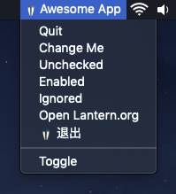
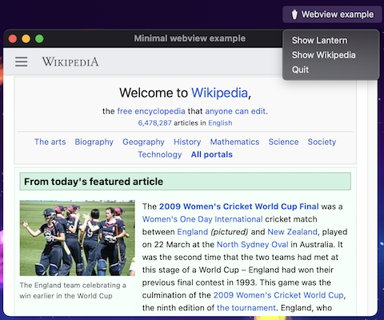

systray is a cross-platform Go library to place an icon and menu in the notification area, with [webview](https://github.com/webview/webview) support!

## Features

* [Webview](https://github.com/webview/webview) support!
* Supported on Windows, macOS, and Linux
* Menu items can be checked and/or disabled
* Methods may be called from any Goroutine

## API

```go
package main

import (
    "github.com/webview/webview"
    "github.com/ghostiam/systray"
    "github.com/ghostiam/systray/example/icon"
)

func main() {
    debug := true
    w := webview.New(debug)
    defer w.Destroy()
    w.SetTitle("Minimal webview example")
    w.SetSize(800, 600, webview.HintNone)
    w.Navigate("https://en.m.wikipedia.org/wiki/Main_Page")
    
    systray.Register(onReady(w))
    
    w.Run()
}

func onReady(w webview.WebView) func() {
    return func () {
        systray.SetIcon(icon.Data)
        systray.SetTitle("Awesome App")
        systray.SetTooltip("Pretty awesome超级棒")
        mQuit := systray.AddMenuItem("Quit", "Quit the whole app")
        
        // Sets the icon of a menu item. Only available on Mac and Windows.
        mQuit.SetIcon(icon.Data)
        
        go func() {
            for {
                select {
                case <-mQuit.ClickedCh:
                    w.Terminate()
                }
            }
        }()
    }
}
```

See [full API](https://pkg.go.dev/github.com/ghostiam/systray?tab=doc) as well as [CHANGELOG](https://github.com/ghostiam/systray/tree/master/CHANGELOG.md).

Note: this package requires cgo, so make sure you set `CGO_ENABLED=1` before building.

## Try the example app!

Have go v1.12+ or higher installed? Here's an example to get started on macOS:

```sh
git clone https://github.com/ghostiam/systray
cd example
env GO111MODULE=on go build ./example
```

On Windows, you should build like this:

```
env GO111MODULE=on go build -ldflags "-H=windowsgui"
```

The following text will then appear on the console:


```sh
go: finding github.com/skratchdot/open-golang latest
go: finding github.com/getlantern/systray latest
go: finding github.com/getlantern/golog latest
```

Now look for *Awesome App* in your menu bar!



## The Webview example

The code under `webview_example` is to demostrate how it can co-exist with [webview](https://github.com/webview/webview). 



## Platform notes

### Linux

* Building apps requires gcc as well as the `gtk3`, `libayatana-appindicator3` and `libwebkit2gtk-4.0-dev` (for [webview](https://github.com/webview/webview)) development headers to be installed. For Debian or Ubuntu, you may install these using:

```sh
sudo apt-get install gcc libgtk-3-dev libayatana-appindicator3-dev libwebkit2gtk-4.0-dev
```

On Linux Mint, `libxapp-dev` is also required.

If you need to support the older `libappindicator3` library instead, you can pass the build flag `legacy_appindicator`
when building. For example:

```
go build -tags=legacy_appindicator
```

### Windows

* To avoid opening a console at application startup, use these compile flags:

```sh
go build -ldflags -H=windowsgui
```

Also, on Windows, `webview.dll` and `WebView2Loader.dll` must be placed into the same directory with your app executable.

### macOS

On macOS, you will need to create an application bundle to wrap the binary; simply folders with the following minimal structure and assets:

```
SystrayApp.app/
  Contents/
    Info.plist
    MacOS/
      go-executable
    Resources/
      SystrayApp.icns
```

When running as an app bundle, you may want to add one or both of the following to your Info.plist:

```xml
<!-- avoid having a blurry icon and text -->
	<key>NSHighResolutionCapable</key>
	<string>True</string>

	<!-- avoid showing the app on the Dock -->
	<key>LSUIElement</key>
	<string>1</string>
```

Consult the [Official Apple Documentation here](https://developer.apple.com/library/archive/documentation/CoreFoundation/Conceptual/CFBundles/BundleTypes/BundleTypes.html#//apple_ref/doc/uid/10000123i-CH101-SW1).

## Credits

- https://github.com/xilp/systray
- https://github.com/cratonica/trayhost
